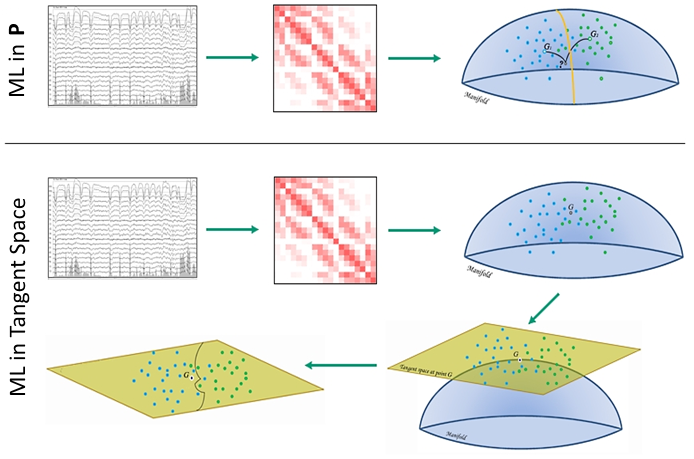

# RiemannianML Documentation

## Requirements

**Julia version ≥ 1.0.3**
**Python** [ScikitLearn](https://scikit-learn.org/stable/install.html) 

This package makes use of :
- [PosDefManifold.jl](https://github.com/Marco-Congedo/PosDefManifold.jl)
- ScikitLearn.Crossvalidation

## Installation

Execute the following command in Julia's REPL:

    ]add RiemannianML

To obtain the latest development version execute instead

    ]add RiemannianML#master


## Overview


**Riemannian geometry** studies smooth manifolds, multi-dimensional curved spaces with peculiar geometries endowed with non-Euclidean metrics. In these spaces Riemannian geometry allows the definition of **angles**, **geodesics** (shortest path between two points), **distances** between points, **centers of mass** of several points, etc.

In several fields of research such as *computer vision* and *brain-computer interface*, treating data in the **P** manifold has allowed the introduction of machine learning approaches with remarkable characteristics, such as simplicity of use, excellent classification accuracy, as demonstrated by the [winning score](http://alexandre.barachant.org/challenges/) obtained in six international data classification competitions, and the ability to operate transfer learning [(Congedo et *al.*, 2017a, ](https://bit.ly/2HOk5qN)[Brachant et *al.*))](https://hal.archives-ouvertes.fr/hal-00681328)

In this package we are concerned with making use of Riemannian Geometry in classification of data in the manifold of Positive Definite Matrices. This can be done in two ways, either in the **Positive Definite Manifold** or in the **Tangent Space** of mapped data. 
  
- **Positive Definite Manifold :** Here we can use different distance metrics to compute the distances between the points represented by positive definite matrices. Using thsi we apply MDM(Minimum Distance to Mean) criteria for classifying test data in the positive defininite manifold.
- **Tangent Space :** Here the data points from the manifold of positive definite matrices are mapped to their corresponding points in the tangent space of the mean point of the set. Since the manifold of positive definite matrices forms a Riemannian manifold, so this brings us the opportunity to implement all the machine learning algorithms from scikit-learn. The reason being that the tangent space behaves like an Eucledian space, so it opens the way to all the general machine learning algorithms implemented in sckit-learn as they assume the metric apace to be Eucledian. The mapping is done using a specific function **logmap** from the PosDefManifold.

The important point to be marked is that our points are not vectors but covariance matrices in the Positive Definite Manifold. This is unlike what we have in traditional Machine Learning i.e. training examples as vectors. So, to apply traditional machine learning algorithms we first perform this mapping into the tangent space.



Figure 1. Schematic representation of the entire process. The raw data which are first converted into their covariance matrices. Following that we have the two choices i.e. directly do classification in the manifold or map the points in the tangent space and apply Machine Learning models.


This package makes extensive use of the functions from the package [PostDefManifold](https://marco-congedo.github.io/PosDefManifold.jl/latest/) 

For a formal introduction to the **P** manifold the reader is referred to the monography written by **R. Bhatia (2007) Positive Definite Matrices. Princeton University press**.

For an introduction to Riemannian geometry and an overview of mathematical tools implemented in this package, see [Intro to Riemannian Geometry](https://marco-congedo.github.io/PosDefManifold.jl/latest/introToRiemannianGeometry/) in the documentation of PostDefManifold.

For starting using this package, browse the code units listed here below and execute the many **example section** you will find therein.

## Code units

**RiemannianML** includes seven code units (.jl files):

| Unit   | Description |
|:----------|:----------|
| [MainModule (RiemannianML.jl)](@ref) | Main module, constants, types, aliases, tips & tricks |
| [knn.jl](@ref) | Unit implementing Kneighbhor Classification |
| [logisticRegression.jl](@ref) | Unit implementing LogisticRegression and LogisticRegressionCV |
| [SVM.jl](@ref) | Unit implementing LinearSVC and SVC |
| [mdm.jl](@ref) | Unit implementing MDM( Minimum Distance to Mean) classification |
| [train_test.jl](@ref) | Unit implementing the tranformation function. Along with overwriting fit!, predict and cross_val_score from the ScikitLearn.jl package |
| [example.jl](@ref) | Unit containing examples for understanding and execution |

## 🎓

**References**

M. Congedo, A. Barachant, R. Bhatia R (2017a)
[Riemannian Geometry for EEG-based Brain-Computer Interfaces; a Primer and a Review](https://bit.ly/2HOk5qN),
Brain-Computer Interfaces, 4(3), 155-174.

Alexandre Barachant 1 Stéphane Bonnet 1 Marco Congedo 2 Christian Jutten 2
[Multiclass Brain-Computer Interface Classification by Riemannian Geometry](https://hal.archives-ouvertes.fr/hal-00681328)

R. Bhatia (2007)
Positive Definite Matrices.
Princeton University press.

A. Barachant, S. Bonnet, M. Congedo, C. Jutten (2012) [Multi-class Brain Computer Interface Classification by Riemannian Geometry, IEEE Transactions on Biomedical Engineering, 59(4), 920-928](https://hal.archives-ouvertes.fr/hal-00681328/document).

A. Barachant, S. Bonnet, M. Congedo, C. Jutten (2013) [Classification of covariance matrices using a Riemannian-based kernel for BCI applications, Neurocomputing, 112, 172-178](https://hal.archives-ouvertes.fr/hal-00820475/document).

M. Congedo, A. Barachant, R. Bhatia R (2017a) [Riemannian Geometry for EEG-based Brain-Computer Interfaces; a Primer and a Review, Brain-Computer Interfaces, 4(3), 155-174](https://bit.ly/2HOk5qN).

M. Congedo, A. Barachant, E. Kharati Koopaei (2017b) [Fixed Point Algorithms for Estimating Power Means of Positive Definite Matrices, IEEE Transactions on Signal Processing, 65(9), 2211-2220](https://bit.ly/2HKEcGk).

Or one may directly look into the [Intro to Riemannian Geometry](https://marco-congedo.github.io/PosDefManifold.jl/latest/introToRiemannianGeometry/) section of the PostDefManifold documentation and quench all their doubts. 


## Contents

```@contents
Pages = [       "index.md",
                "MainModule.md",
                "knn.md",
                "logisticRegression.md",
                "SVM.md",
                "mdm.md",
		"train_test.md",
		"example.md"]
Depth = 1
```

## Index

```@index
```
